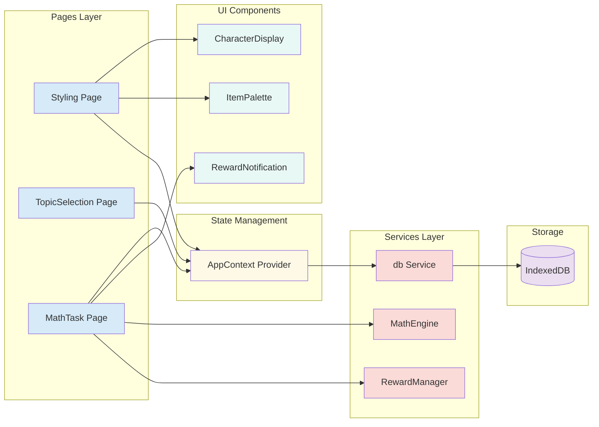
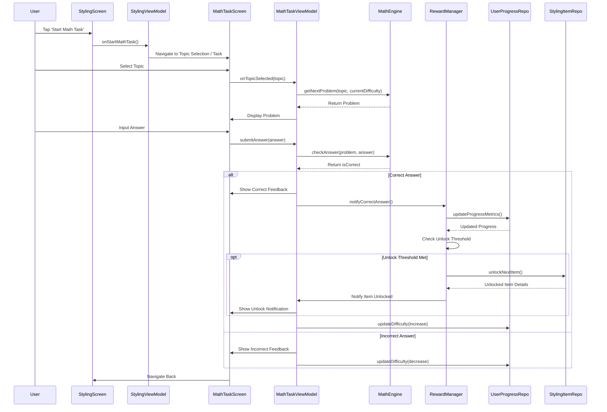
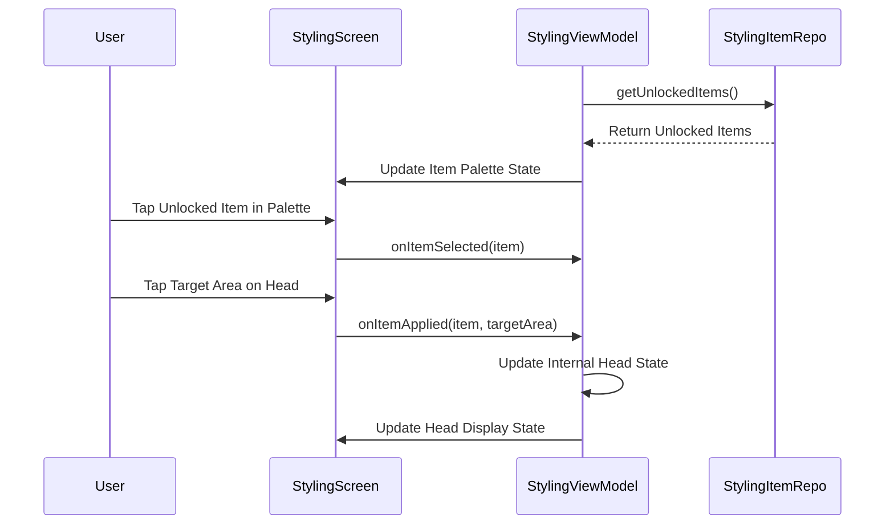

Okay, here's the complete content for the `architecture.md` file based on our detailed discussion:

````markdown
# Mathe-Stylistin Architecture Document

## Introduction

This document outlines the overall project architecture for the **Mathe-Stylistin** Web Application MVP. [cite_start]It covers the application structure, component design, data management, and technical standards necessary to build the initial version based on the requirements defined in the Product Requirements Document (PRD) [cite: 1603] [cite_start]and the UI/UX Specification[cite: 1555]. [cite_start]Its primary goal is to serve as the guiding architectural blueprint for development, ensuring consistency and adherence to chosen patterns and technologies[cite: 408]. As this MVP is a React-based web application, this document covers both client-side application logic and UI-related architectural concerns.

### Starter Template or Existing Project

[cite_start]Based on the PRD and Project Brief, this is a **greenfield project**[cite: 1637]. [cite_start]The project uses **React with TypeScript and Vite** as the foundation[cite: 1021, 1155]. [cite_start]The application follows modern React conventions with a client-server monorepo structure, using Vite for fast development and optimized production builds[cite: 416].

### Change Log

| Date             | Version | Description                   | Author       |
| :--------------- | :------ | :---------------------------- | :----------- |
| October 25, 2025 | 0.1     | Initial Architecture draft    | Arch Winston |
| October 25, 2025 | 0.2     | Updated for React/TypeScript web stack | Arch Winston |

---

## High Level Architecture

This section establishes the foundational architectural approach for the native Android MVP.

### Technical Summary

[cite_start]The "Mathe-Stylistin" MVP is a **React-based web application** built using **TypeScript**, **React 18+**, and **Vite** for the build system[cite: 1155]. [cite_start]It follows a **client-side architecture**, with all core logic (math problem generation, adaptive difficulty, reward system) and data persistence (unlocked items, user progress) residing within the browser using **IndexedDB**[cite: 1021]. [cite_start]The architecture prioritizes a **simple, modular structure** suitable for the MVP scope, focusing on the core user flow of solving math problems to unlock and apply creative styling items[cite: 420].

### High Level Overview

1.  [cite_start]**Architectural Style:** Primarily a **client-side web application** with all logic contained within the browser[cite: 422]. No backend services are used for the MVP beyond static file serving.
2.  [cite_start]**Repository Structure:** A **single monorepo** containing both client (React) and server (Express) code[cite: 384, 1021].
3.  **Core Components:**
    * UI Layer (React): Manages the styling interface, math task presentation, and user interactions using React components.
    * Math Engine: Handles generation of curriculum-aligned problems, adaptive difficulty adjustments, and answer checking.
    * Reward/Unlock Logic: Manages the criteria for unlocking items based on math performance.
    * Data Persistence Layer: Saves and retrieves user progress (unlocked items, difficulty level) using browser IndexedDB.
4.  **Primary User Flow:** Solve Math Task -> Check Answer -> (If Correct) Trigger Reward Logic -> Update Persistence -> Update UI (Show Unlock/New Item) -> Apply Styling.
5.  [cite_start]**Key Decisions:** React web application chosen for cross-platform compatibility and rapid development; IndexedDB chosen to simplify MVP development by avoiding backend setup while enabling offline functionality[cite: 423].

### High Level Project Diagram

```mermaid
graph TD
    subgraph "React Web Application (Mathe-Stylistin MVP)"
        A[UI Layer (React Components)] -- Interacts with --> B[Context/State Management];
        B -- Uses --> C[Math Engine Logic];
        B -- Uses --> D[Reward/Unlock Logic];
        B -- Uses --> E[Data Persistence Layer];
        C -- Accesses --> E;
        D -- Modifies --> E;
        E -- Uses --> F[Browser IndexedDB];
    end

    A -- Displays --> User;
    User -- Interacts with --> A;
````

### Architectural and Design Patterns

  * **Component-Based Architecture:** React components organize the UI into reusable, composable pieces. Separation of concerns between presentational and container components.
      * *Rationale:* Standard React practice, promotes reusability, testability, and maintainability.
  * **Context API for Global State:** React Context API manages global application state (user progress, unlocked items, current styling).
      * *Rationale:* Built-in React solution, appropriate for MVP scope, avoids external state management library complexity.
  * **Custom Hooks:** Encapsulate reusable stateful logic in custom hooks (e.g., `useComposition`, `usePersistFn`).
      * *Rationale:* Promotes code reuse, separates concerns, improves testability.
  * [cite\_start]**Service Layer Pattern:** Separate business logic (MathEngine, RewardManager) from UI components[cite: 428].
      * [cite\_start]*Rationale:* Decouples logic from UI, simplifies testing, makes future changes easier[cite: 654].
  * **Client-Side Routing:** Wouter provides lightweight client-side routing for navigation between screens.
      * *Rationale:* Minimal bundle size, simple API, sufficient for MVP needs.

-----

## Tech Stack

### Cloud Infrastructure

  * [cite\_start]**Provider:** N/A (MVP uses browser local storage only)[cite: 433].
  * **Key Services:** Optional static hosting (Vercel, Netlify, or similar for deployment).
  * **Deployment Regions:** N/A for MVP (CDN distribution available through hosting providers).

### Technology Stack Table

| Category            | Technology        | Version (Minimum/Target) | Purpose                                  | Rationale                                                                 |
| :------------------ | :---------------- | :----------------------- | :--------------------------------------- | :------------------------------------------------------------------------ |
| **Language** | TypeScript        | 5.6+                     | Primary development language             | Type safety, excellent IDE support, catches errors at compile time    |
| **Runtime** | Node.js           | 20+                      | Server runtime for Express               | Industry standard, excellent ecosystem                                    |
| **UI Framework** | React             | 18.3+                    | Declarative UI library                   | Component-based architecture, large ecosystem, excellent performance      |
| **Build Tool** | Vite              | 7.1+                     | Fast dev server and build tool           | Lightning-fast HMR, optimized production builds, modern ESM-based         |
| **Styling** | Tailwind CSS      | 4.1+                     | Utility-first CSS framework              | Rapid UI development, consistent design system, small bundle size         |
| **UI Components** | Shadcn/ui         | Latest                   | Accessible component library             | Built on Radix UI, customizable, accessible, TypeScript-first            |
| **UI Primitives** | Radix UI          | Latest                   | Unstyled accessible components           | WCAG compliant, keyboard navigation, screen reader support                |
| **Router** | Wouter            | 3.3+                     | Lightweight client-side routing          | Minimal bundle size (1.3KB), simple API, React hooks-based                |
| **State Management** | React Context  | Built-in                 | Global application state                 | No external dependency, sufficient for MVP scope                          |
| **Data Queries** | TanStack Query    | 4.41+                    | Server state management                  | Caching, background updates, optimistic updates (for future API use)      |
| **Local Storage** | IndexedDB         | Browser API              | Client-side data persistence             | Structured storage, works offline, async API, large storage capacity      |
| **Animations** | Framer Motion     | 12.23+                   | Animation library                        | Declarative animations, smooth performance, gesture support               |
| **Icons** | Lucide React      | Latest                   | Icon library                             | Consistent design, tree-shakeable, extensive collection                   |
| **Forms** | React Hook Form   | 7.64+                    | Form validation and management           | Excellent performance, minimal re-renders, TypeScript support             |
| **Schema Validation** | Zod           | 4.1+                     | Runtime type validation                  | TypeScript-first, composable schemas, excellent error messages            |
| **Server** | Express           | 4.21+                    | Static file server                       | Lightweight, standard, simple setup for serving built assets              |
| **Package Manager** | pnpm            | 10.4+                    | Fast, disk-efficient package manager     | Faster than npm/yarn, saves disk space, strict dependency resolution      |
| **Unit Testing** | Vitest            | 2.1+                     | Fast unit test framework                 | Vite-native, Jest-compatible API, excellent TypeScript support            |
| **Component Testing** | React Testing Library | 16.3+            | React component testing                  | Encourages accessibility, tests user behavior not implementation          |
| **Test Utilities** | jsdom             | 27.0+                    | DOM implementation for Node.js           | Enables component testing in Node environment                             |
| **Browser Compatibility** | Evergreen browsers | Chrome 90+, Firefox 88+, Safari 14+, Edge 90+ | Target browsers | Modern features, broad coverage, automatic updates                        |

-----

## Data Models

We need to store two main types of information locally for the MVP: the status of unlockable styling items and the user's progress.

### 1\. StylingItem Interface

Represents a single unlockable styling item (like a color or an accessory).

```typescript
// TypeScript interface for StylingItem
export interface StylingItem {
  id: string;                    // Unique ID, e.g., "color_red", "accessory_glasses1"
  type: 'color' | 'accessory' | 'effect'; // Item type
  name: string;                  // Display name, e.g., "Glitter Pink", "Cool Glasses"
  assetReference: string;        // Reference to the visual asset (e.g., CSS value, image path)
  isUnlocked: boolean;           // Tracks if the user has unlocked this item
  category?: string;             // Optional category for organization
}
```

**Purpose:** To keep track of all available styling items and whether the user has earned access to them.
**Key Attributes:** A unique ID, type (color/accessory/effect), display name, a way to reference the visual asset, and a boolean `isUnlocked` flag.
**Storage:** Stored in IndexedDB in the `styling_items` object store.
**Initial State:** A predefined list of items will be initialized in IndexedDB on first launch, some marked as `isUnlocked: true`, others `isUnlocked: false`.

### 2\. UserProgress Interface

Represents the user's current learning state and progress.

```typescript
// TypeScript interface for UserProgress
export interface UserProgress {
  id: number;                         // Singleton entity, always use ID 1
  difficultyLevelAddition: number;    // Current difficulty for addition (1-10)
  difficultyLevelSubtraction: number; // Current difficulty for subtraction (1-10)
  difficultyLevelMultiplication: number; // Current difficulty for multiplication (1-10)
  difficultyLevelDivision: number;    // Current difficulty for division (1-10)
  difficultyLevelGeometry: number;    // Current difficulty for geometry (1-10)
  difficultyLevelSizes: number;       // Current difficulty for sizes (1-10)
  correctAnswersStreak: number;       // Counter towards next reward unlock
  totalCorrectAnswers: number;        // Total correct answers (for analytics)
  totalIncorrectAnswers: number;      // Total incorrect answers (for analytics)
  lastSessionDate: string;            // ISO date string of last session
}
```

**Purpose:** To store the user's current adaptive difficulty level for different math topics and track metrics needed for the reward system.
**Key Attributes:** Difficulty level per topic (1-10 scale), streak counter for rewards, and session tracking data.
**Storage:** Stored in IndexedDB in the `user_progress` object store as a singleton (always ID 1).
**Relationships:** None directly.

-----

## Components

### Component List

  * **`Styling` (Page Component)**
      * **Responsibility:** Main styling page. Displays character head, item palette, and navigation to math tasks. Renders applied styling. Handles UI interactions.
      * **Key Interfaces:** Uses `AppContext` for global state. Uses custom hooks for composition logic.
      * **Dependencies:** `CharacterDisplay`, `ItemPalette`, `AppContext`, routing (wouter).
      * **Technology Stack:** React, TypeScript, Tailwind CSS.
  * **`TopicSelection` (Page Component)**
      * **Responsibility:** Displays available math topics for user selection.
      * **Key Interfaces:** Uses `AppContext` for navigation and state. Navigates to `MathTask` with selected topic.
      * **Dependencies:** `AppContext`, routing (wouter).
      * **Technology Stack:** React, TypeScript, Shadcn/ui components.
  * **`MathTask` (Page Component)**
      * **Responsibility:** Displays math problems, captures input, provides feedback, triggers rewards, updates progress.
      * **Key Interfaces:** Uses `AppContext` for state. Calls `MathEngine` and `RewardManager` services.
      * **Dependencies:** `MathEngine`, `RewardManager`, `AppContext`, `db` service.
      * **Technology Stack:** React, TypeScript, Shadcn/ui components.
  * **`CharacterDisplay` (Presentational Component)**
      * **Responsibility:** Renders the virtual character head with applied styling items.
      * **Key Interfaces:** Receives `appliedItems` array as props. Pure presentational component.
      * **Dependencies:** None (pure component).
      * **Technology Stack:** React, TypeScript, CSS/Tailwind.
  * **`ItemPalette` (Presentational Component)**
      * **Responsibility:** Displays available/unlocked styling items in a selectable palette.
      * **Key Interfaces:** Receives items and selection handlers as props.
      * **Dependencies:** Shadcn/ui components.
      * **Technology Stack:** React, TypeScript, Tailwind CSS.
  * **`RewardNotification` (UI Component)**
      * **Responsibility:** Shows animated notification when new items are unlocked.
      * **Key Interfaces:** Receives unlock event and item details as props.
      * **Dependencies:** Framer Motion for animations.
      * **Technology Stack:** React, TypeScript, Framer Motion.
  * **`AppContext` (Context Provider)**
      * **Responsibility:** Manages global application state (user progress, unlocked items, character state). Provides state and update methods to all components.
      * **Key Interfaces:** Exports context and custom hook `useApp()`. Persists state to IndexedDB.
      * **Dependencies:** `db` service, React Context API.
      * **Technology Stack:** React, TypeScript.
  * **`MathEngine` (Service Class)**
      * **Responsibility:** Generates curriculum-aligned problems based on topic/difficulty. Adjusts difficulty. Checks answers.
      * **Key Interfaces:** Provides `generateProblem()`, `checkAnswer()`, `adjustDifficulty()` methods.
      * **Dependencies:** None (pure logic).
      * **Technology Stack:** TypeScript.
  * **`RewardManager` (Service Class)**
      * **Responsibility:** Determines item unlocks based on progress. Selects next item to unlock.
      * **Key Interfaces:** Provides `shouldUnlockItem()`, `getNextUnlockableItem()` methods.
      * **Dependencies:** None (receives data as parameters).
      * **Technology Stack:** TypeScript.
  * **`db` (IndexedDB Service)**
      * **Responsibility:** Manages all IndexedDB operations. Abstracts database access for styling items and user progress.
      * **Key Interfaces:** CRUD operations for `StylingItem` and `UserProgress`. Initialization and seeding.
      * **Dependencies:** Browser IndexedDB API.
      * **Technology Stack:** TypeScript, native IndexedDB API.

### Component Diagrams



-----

## External APIs

This section is **Not Applicable (N/A)** for the MVP of "Mathe-Stylistin".
[cite\_start]**Rationale:** The MVP uses local storage only and does not integrate with external services[cite: 1021].

-----

## Core Workflows

### 1\. Workflow: Complete Math Task & Unlock Item



### 2\. Workflow: Apply Styling Item



-----

## REST API Spec

This section is **Not Applicable (N/A)** for the MVP of "Mathe-Stylistin".
[cite\_start]**Rationale:** No backend or REST API is required for the MVP[cite: 670].

-----

## Database Schema

Based on browser IndexedDB.

### IndexedDB Database: `mathe_stylistin_db`

**Version:** 1

### Object Store: `styling_items`

**Key Path:** `id`

**Structure:**
```typescript
{
  id: string;              // Primary key, e.g., "color_red", "accessory_glasses1"
  type: string;            // "color" | "accessory" | "effect"
  name: string;            // Display name, e.g., "Glitter Pink"
  assetReference: string;  // CSS value, image path, etc.
  isUnlocked: boolean;     // Unlock status
  category?: string;       // Optional category
}
```

**Indexes:**
- `type` (non-unique) - for filtering by item type
- `isUnlocked` (non-unique) - for querying unlocked items

### Object Store: `user_progress`

**Key Path:** `id`

**Structure:**
```typescript
{
  id: number;                         // Always 1 (singleton)
  difficultyLevelAddition: number;    // 1-10
  difficultyLevelSubtraction: number; // 1-10
  difficultyLevelMultiplication: number; // 1-10
  difficultyLevelDivision: number;    // 1-10
  difficultyLevelGeometry: number;    // 1-10
  difficultyLevelSizes: number;       // 1-10
  correctAnswersStreak: number;       // Counter for rewards
  totalCorrectAnswers: number;        // Analytics
  totalIncorrectAnswers: number;      // Analytics
  lastSessionDate: string;            // ISO date string
}
```

**Initial Data:** Created on first app load with default values (all difficulties at 1, all counters at 0).

-----

## Source Tree

```plaintext
src/
├── client/                          # Client-side React application
│   └── src/
│       ├── App.tsx                  # Root App component with routing
│       ├── main.tsx                 # Entry point, renders App
│       ├── const.ts                 # Global constants
│       ├── components/              # Reusable UI components
│       │   ├── CharacterDisplay.tsx
│       │   ├── ItemPalette.tsx
│       │   ├── RewardNotification.tsx
│       │   ├── ManusDialog.tsx
│       │   ├── ErrorBoundary.tsx
│       │   └── ui/                  # Shadcn/ui components
│       │       ├── button.tsx
│       │       ├── dialog.tsx
│       │       ├── card.tsx
│       │       └── ... (30+ components)
│       ├── pages/                   # Page-level components (routes)
│       │   ├── Home.tsx
│       │   ├── Styling.tsx
│       │   ├── TopicSelection.tsx
│       │   ├── MathTask.tsx
│       │   └── NotFound.tsx
│       ├── contexts/                # React Context providers
│       │   ├── AppContext.tsx       # Main app state context
│       │   └── ThemeContext.tsx     # Theme management
│       ├── hooks/                   # Custom React hooks
│       │   ├── useComposition.ts
│       │   ├── useMobile.tsx
│       │   └── usePersistFn.ts
│       ├── lib/                     # Business logic & utilities
│       │   ├── mathEngine.ts        # Math problem generation
│       │   ├── rewardManager.ts     # Reward/unlock logic
│       │   ├── db.ts                # IndexedDB service
│       │   ├── initialData.ts       # Initial data seeding
│       │   ├── utils.ts             # Utility functions
│       │   └── __tests__/           # Unit tests
│       │       ├── mathEngine.test.ts
│       │       └── rewardManager.test.ts
│       ├── types/                   # TypeScript type definitions
│       │   └── models.ts            # Data model interfaces
│       ├── test/                    # Test configuration
│       │   └── setup.ts
│       └── index.css                # Global styles & Tailwind
├── server/                          # Express server (static file serving)
│   └── index.ts                     # Server entry point
├── shared/                          # Shared code between client/server
│   └── const.ts
├── package.json                     # Dependencies & scripts
├── tsconfig.json                    # TypeScript configuration
├── vite.config.ts                   # Vite build configuration
├── vitest.config.ts                 # Vitest test configuration
├── tailwind.config.ts               # Tailwind CSS configuration
└── .env                             # Environment variables (if needed)
```

-----

## Infrastructure and Deployment

### Infrastructure as Code

  * **Tool:** N/A for MVP (simple static hosting).
  * **Location:** N/A.
  * [cite\_start]**Approach:** Browser-based application with static file hosting[cite: 465].

### Deployment Strategy

  * [cite\_start]**Strategy:** Static site deployment to web hosting platform (Vercel, Netlify, or similar)[cite: 466].
  * [cite\_start]**Build Process:** `npm run build` (or `pnpm build`) creates optimized production bundle via Vite[cite: 466].
  * [cite\_start]**CI/CD Platform:** GitHub Actions recommended for automated builds, tests, and deployments[cite: 466].
  * [cite\_start]**Pipeline Configuration:** Build on push to main → Run tests → Deploy to production[cite: 466].

### Environments

  * [cite\_start]**Development:** Local development server via `pnpm dev` (Vite dev server with HMR)[cite: 467].
  * [cite\_start]**Preview:** Preview deployments for pull requests (via hosting platform)[cite: 467].
  * [cite\_start]**Production:** Deployed static site accessible via HTTPS URL[cite: 467].

### Environment Promotion Flow

  * [cite\_start]Development (local) → Preview (PR deployments) → Production (main branch)[cite: 467].

### Rollback Strategy

  * [cite\_start]**Primary Method:** Git-based rollback (revert commit and redeploy)[cite: 468].
  * [cite\_start]**Trigger Conditions:** Critical bugs or performance issues in production[cite: 468].
  * [cite\_start]**Recovery Time Objective:** < 10 minutes (automated deployment pipeline)[cite: 468].

-----

## Error Handling Strategy

[cite\_start]Focus on graceful handling and simple user feedback[cite: 469].

### General Approach

  * [cite\_start]**Error Model:** TypeScript `try-catch` with async/await[cite: 471].
  * [cite\_start]**Error Types:** Use custom error classes for specific scenarios (e.g., `DatabaseError`, `ValidationError`)[cite: 471].
  * [cite\_start]**Error Propagation:** Service layer errors caught and handled in components, state updated with error message, user sees friendly notification[cite: 471].

### Logging Standards

  * [cite\_start]**Library:** `console.error()`, `console.warn()`, `console.log()` (browser console)[cite: 472].
  * [cite\_start]**Format:** Structured logging with context (component/function name, relevant data)[cite: 472].
  * [cite\_start]**Levels:** `console.error` (errors), `console.warn` (warnings), `console.log` (debug info - remove in production)[cite: 472].
  * **Context:** Component/function name, timestamp. [cite\_start]No sensitive data (user inputs, personal info)[cite: 472]. [cite\_start]No remote logging for MVP[cite: 472].

### Error Handling Patterns

  * [cite\_start]**IndexedDB Errors:** Wrap db operations in try-catch, log error, return error state to component, show user-friendly message via toast/notification[cite: 476].
  * [cite\_start]**Business Logic Errors:** Validate inputs, throw descriptive errors, catch in component, display helpful feedback to user[cite: 475].
  * [cite\_start]**React Errors:** Use ErrorBoundary component to catch rendering errors, show fallback UI, log error details[cite: 473].
  * **Async Errors:** Always use try-catch with async/await, handle rejected promises, show loading and error states.

-----

## Coding Standards

### Core Standards

  * [cite\_start]**Language:** TypeScript (5.6+) with strict mode enabled[cite: 480].
  * [cite\_start]**Style & Linting:** Prettier for formatting, ESLint for linting (React + TypeScript rules)[cite: 480].
  * [cite\_start]**Test Organization:** Unit tests colocated in `__tests__` folders, test files end with `.test.ts` or `.test.tsx`[cite: 480].

### Naming Conventions

  * **Components:** PascalCase (e.g., `CharacterDisplay.tsx`, `ItemPalette.tsx`).
  * **Hooks:** camelCase starting with `use` (e.g., `useComposition.ts`).
  * **Services/Utilities:** camelCase (e.g., `mathEngine.ts`, `db.ts`).
  * **Types/Interfaces:** PascalCase (e.g., `StylingItem`, `UserProgress`).
  * **Constants:** UPPER_SNAKE_CASE for true constants, camelCase for config objects.
  * **File Names:** Match primary export, use kebab-case for multi-word UI components folder.

### Critical Rules

  * **Immutability:** Use `const` by default, prefer immutable data patterns, avoid mutations.
  * **State Management:** Use React hooks (`useState`, `useContext`) properly, avoid prop drilling beyond 2 levels.
  * **Type Safety:** Enable strict TypeScript, avoid `any`, use explicit types for function params/returns.
  * **Error Handling:** Use try-catch for async operations, provide user-friendly error messages.
  * **Accessibility:** Use semantic HTML, ARIA labels where needed, ensure keyboard navigation.
  * **Performance:** Use `React.memo` for expensive components, avoid inline function definitions in render.
  * **Async Operations:** Use async/await, handle promises properly, show loading states.

### React-Specific Guidelines

  * **Component Structure:** Functional components with hooks only (no class components).
  * **Props:** Use TypeScript interfaces for prop types, destructure props at function signature.
  * **Hooks Order:** Follow Rules of Hooks (call hooks at top level, same order every render).
  * **Effects:** Keep `useEffect` focused, clean up side effects, list all dependencies.
  * **Keys:** Use stable, unique keys for list items (not array index).

-----

## Test Strategy and Standards

### Testing Philosophy

  * [cite\_start]**Approach:** Focus on Unit Tests (business logic) and Component Tests (UI interactions)[cite: 489]. [cite\_start]TDD encouraged[cite: 489].
  * **Coverage Goals:** >80% unit test coverage for services/logic; [cite\_start]~70% overall project coverage for MVP[cite: 489].
  * [cite\_start]**Test Pyramid:** Prioritize unit tests, supplement with component tests[cite: 489]. [cite\_start]E2E out of scope for MVP[cite: 489].

### Test Types and Organization

#### Unit Tests

  * [cite\_start]**Framework:** Vitest (Vite-native, Jest-compatible API)[cite: 490].
  * [cite\_start]**Location:** `src/client/src/lib/__tests__/`[cite: 490].
  * **Scope:** Isolate business logic (MathEngine, RewardManager, db service). [cite\_start]Pure functions, no React dependencies[cite: 490].
  * [cite\_start]**Pattern:** Arrange-Act-Assert (AAA); test public APIs, edge cases, error handling[cite: 491].
  * **Example:**
    ```typescript
    describe('MathEngine', () => {
      it('should generate addition problems with correct answer', () => {
        const engine = new MathEngine();
        const problem = engine.generateProblem('addition', 1);
        expect(problem.topic).toBe('addition');
        expect(typeof problem.correctAnswer).toBe('number');
      });
    });
    ```

#### Component Tests

  * [cite\_start]**Framework:** React Testing Library + Vitest[cite: 492].
  * [cite\_start]**Scope:** Test React components in isolation, verify user interactions and state updates[cite: 492].
  * [cite\_start]**Location:** Colocated with components or in dedicated test files[cite: 492].
  * **Focus:** User behavior over implementation details (query by role, label, text, not internal state).
  * **Example:**
    ```typescript
    import { render, screen, fireEvent } from '@testing-library/react';
    import { ItemPalette } from '../ItemPalette';

    test('displays unlocked items', () => {
      const items = [{ id: '1', name: 'Red', isUnlocked: true }];
      render(<ItemPalette items={items} onSelect={() => {}} />);
      expect(screen.getByText('Red')).toBeInTheDocument();
    });
    ```

#### Integration Tests

  * **Scope:** Test integration between AppContext, db service, and IndexedDB (optional for MVP).
  * **Approach:** Use fake/mock IndexedDB if needed, or test against real browser IndexedDB in jsdom.

### Test Data Management

  * **Strategy:** Use factory functions to create test data objects.
  * [cite\_start]**Fixtures:** Reusable test data builders for `StylingItem`, `UserProgress`, etc.[cite: 495].
  * [cite\_start]**Cleanup:** Vitest automatically resets mocks; clear IndexedDB state between integration tests[cite: 495].

### Continuous Testing

  * [cite\_start]**CI Integration:** Run `pnpm test` on every push/PR via GitHub Actions[cite: 496].
  * [cite\_start]**Watch Mode:** Local development uses `pnpm test` in watch mode for instant feedback[cite: 496].
  * [cite\_start]**Coverage Reports:** Generate with `pnpm test:coverage`, aim for >70% overall[cite: 496].
  * [cite\_start]**Performance/Security Tests:** N/A for MVP[cite: 496].

-----

## Security

Minimal for MVP due to client-side only nature. [cite\_start]Focus on data minimization and browser security defaults[cite: 497].

### Input Validation

  * [cite\_start]**Strategy:** Basic validation for math answer inputs (type checking, range validation)[cite: 498].
  * [cite\_start]**Location:** `MathTask` component and `MathEngine` service[cite: 498].
  * **Sanitization:** Use Zod schemas for runtime validation where needed.

### Authentication & Authorization

  * [cite\_start]N/A for MVP (no user accounts, no backend)[cite: 500].

### Secrets Management

  * [cite\_start]N/A for MVP (no API keys or secrets)[cite: 501].

### API Security

  * [cite\_start]N/A for MVP (no external APIs)[cite: 502].

### Data Protection

  * [cite\_start]**Storage:** Client-side only via browser IndexedDB[cite: 503].
  * [cite\_start]**Encryption at Rest:** Rely on browser's built-in storage encryption (varies by browser/OS)[cite: 503].
  * [cite\_start]**PII Handling:** MUST NOT collect any personally identifiable information[cite: 503].
  * [cite\_start]**Logging Restrictions:** Do not log user answers, session data, or any user-specific information[cite: 503].
  * **HTTPS:** Deploy over HTTPS to prevent man-in-the-middle attacks.

### Content Security Policy

  * **CSP Headers:** Implement basic CSP headers to prevent XSS attacks.
  * **Script Sources:** Restrict script execution to same-origin and trusted CDNs.

### Dependency Security

  * [cite\_start]**Approach:** Use up-to-date npm packages; run `pnpm audit` regularly; avoid unnecessary dependencies[cite: 504].
  * **Updates:** Monitor for security advisories, update dependencies promptly.
  * **Lock File:** Commit `pnpm-lock.yaml` to ensure reproducible builds.

### Security Testing

  * [cite\_start]N/A for MVP (beyond basic input validation checks and dependency audits)[cite: 505].

-----

## Checklist Results Report

*(Simulated `architect-checklist` results)*

### Executive Summary

  * **Overall architecture readiness:** High (approx. 90-95% for MVP planning).
  * **Critical risks identified:** Low (future scalability, platform choice).
  * **Key strengths:** Clear MVVM, standard libraries, MVP simplicity.
  * **Project type:** Native Android Mobile App. Backend/infra/complex security sections simplified/N/A.

### Section Analysis (Simplified for MVP)

  * Requirements Alignment: PASS.
  * Architecture Fundamentals: PASS.
  * Technical Stack: PASS.
  * Frontend Design (Adapted): PASS.
  * Resilience & Operations: PASS (Simplified).
  * Security: PASS (Simplified).
  * Implementation Guidance: PASS.
  * Dependency Management: PASS.
  * AI Agent Suitability: PASS.
  * Accessibility: PASS (MVP Basics).

### Risk Assessment

  * **Top Risks:** Local Storage Migration, Platform Lock-in, Asset Dependency.
  * **Overall Risk:** Low for MVP.

### Recommendations

  * **Should-fix:** Confirm Room vs. DataStore, finalize min SDK.
  * **Nice-to-have:** Consider basic DI (Hilt).

### AI Implementation Readiness

  * MVVM structure is suitable. Standards provide guidance.

### Final Assessment

  * Architecture is **ready** for PO validation and development.

-----
