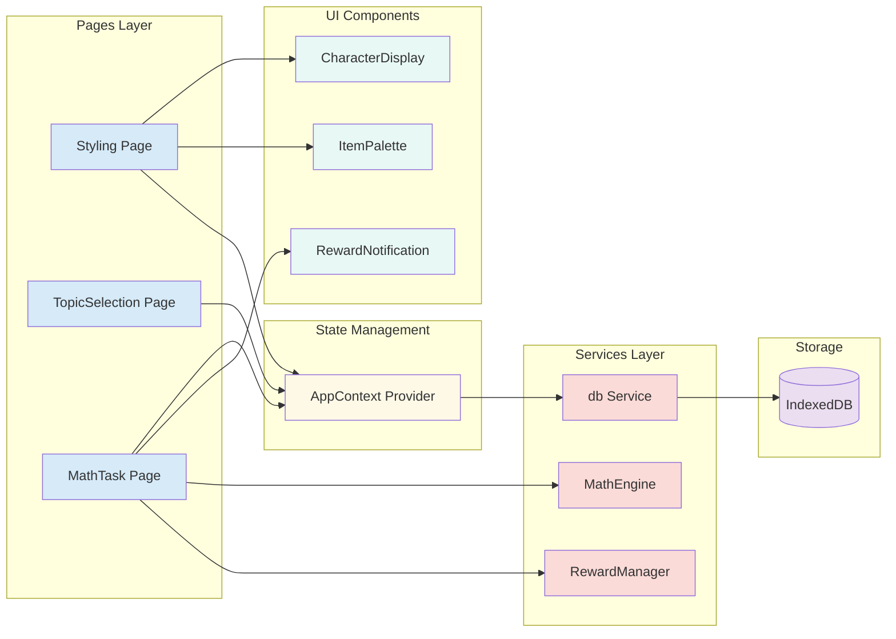

# Components

## Component List

  * **`Styling` (Page Component)**
      * **Responsibility:** Main styling page. Displays character head, item palette, and navigation to math tasks. Renders applied styling. Handles UI interactions.
      * **Key Interfaces:** Uses `AppContext` for global state. Uses custom hooks for composition logic.
      * **Dependencies:** `CharacterDisplay`, `ItemPalette`, `AppContext`, routing (wouter).
      * **Technology Stack:** React, TypeScript, Tailwind CSS.
  * **`TopicSelection` (Page Component)**
      * **Responsibility:** Displays available math topics for user selection.
      * **Key Interfaces:** Uses `AppContext` for navigation and state. Navigates to `MathTask` with selected topic.
      * **Dependencies:** `AppContext`, routing (wouter).
      * **Technology Stack:** React, TypeScript, Shadcn/ui components.
  * **`MathTask` (Page Component)**
      * **Responsibility:** Displays math problems, captures input, provides feedback, triggers rewards, updates progress.
      * **Key Interfaces:** Uses `AppContext` for state. Calls `MathEngine` and `RewardManager` services.
      * **Dependencies:** `MathEngine`, `RewardManager`, `AppContext`, `db` service.
      * **Technology Stack:** React, TypeScript, Shadcn/ui components.
  * **`CharacterDisplay` (Presentational Component)**
      * **Responsibility:** Renders the virtual character head with applied styling items.
      * **Key Interfaces:** Receives `appliedItems` array as props. Pure presentational component.
      * **Dependencies:** None (pure component).
      * **Technology Stack:** React, TypeScript, CSS/Tailwind.
  * **`ItemPalette` (Presentational Component)**
      * **Responsibility:** Displays available/unlocked styling items in a selectable palette.
      * **Key Interfaces:** Receives items and selection handlers as props.
      * **Dependencies:** Shadcn/ui components.
      * **Technology Stack:** React, TypeScript, Tailwind CSS.
  * **`RewardNotification` (UI Component)**
      * **Responsibility:** Shows animated notification when new items are unlocked.
      * **Key Interfaces:** Receives unlock event and item details as props.
      * **Dependencies:** Framer Motion for animations.
      * **Technology Stack:** React, TypeScript, Framer Motion.
  * **`AppContext` (Context Provider)**
      * **Responsibility:** Manages global application state (user progress, unlocked items, character state). Provides state and update methods to all components.
      * **Key Interfaces:** Exports context and custom hook `useApp()`. Persists state to IndexedDB.
      * **Dependencies:** `db` service, React Context API.
      * **Technology Stack:** React, TypeScript.
  * **`MathEngine` (Service Class)**
      * **Responsibility:** Generates curriculum-aligned problems based on topic/difficulty. Adjusts difficulty. Checks answers.
      * **Key Interfaces:** Provides `generateProblem()`, `checkAnswer()`, `adjustDifficulty()` methods.
      * **Dependencies:** None (pure logic).
      * **Technology Stack:** TypeScript.
  * **`RewardManager` (Service Class)**
      * **Responsibility:** Determines item unlocks based on progress. Selects next item to unlock.
      * **Key Interfaces:** Provides `shouldUnlockItem()`, `getNextUnlockableItem()` methods.
      * **Dependencies:** None (receives data as parameters).
      * **Technology Stack:** TypeScript.
  * **`db` (IndexedDB Service)**
      * **Responsibility:** Manages all IndexedDB operations. Abstracts database access for styling items and user progress.
      * **Key Interfaces:** CRUD operations for `StylingItem` and `UserProgress`. Initialization and seeding.
      * **Dependencies:** Browser IndexedDB API.
      * **Technology Stack:** TypeScript, native IndexedDB API.

## Component Diagrams

-----
