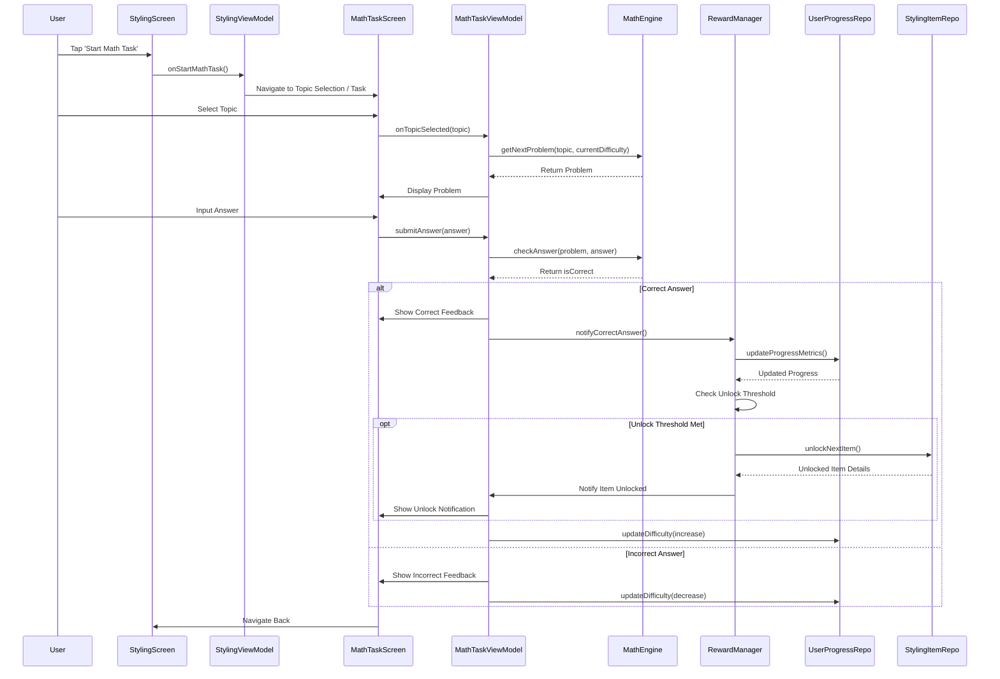
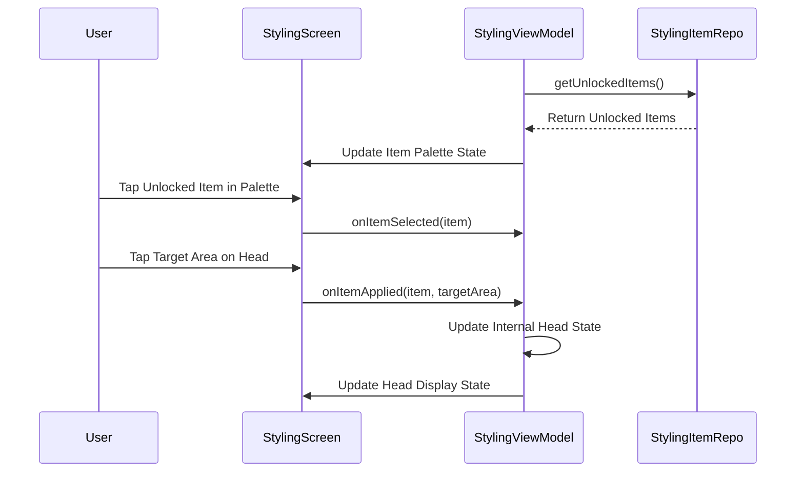

# Core Workflows

## 1\. Workflow: Complete Math Task & Unlock Item

```mermaid
sequenceDiagram
    participant User
    participant StylingScreen
    participant StylingViewModel
    participant MathTaskScreen
    participant MathTaskViewModel
    participant MathEngine
    participant RewardManager
    participant UserProgressRepo
    participant StylingItemRepo

    User->>StylingScreen: Tap 'Start Math Task'
    StylingScreen->>StylingViewModel: onStartMathTask()
    StylingViewModel->>MathTaskScreen: Navigate to Topic Selection / Task
    User->>MathTaskScreen: Select Topic
    MathTaskScreen->>MathTaskViewModel: onTopicSelected(topic)
    MathTaskViewModel->>MathEngine: getNextProblem(topic, currentDifficulty)
    MathEngine-->>MathTaskViewModel: Return Problem
    MathTaskViewModel->>MathTaskScreen: Display Problem
    User->>MathTaskScreen: Input Answer
    MathTaskScreen->>MathTaskViewModel: submitAnswer(answer)
    MathTaskViewModel->>MathEngine: checkAnswer(problem, answer)
    MathEngine-->>MathTaskViewModel: Return isCorrect
    alt Correct Answer
        MathTaskViewModel->>MathTaskScreen: Show Correct Feedback
        MathTaskViewModel->>RewardManager: notifyCorrectAnswer()
        RewardManager->>UserProgressRepo: updateProgressMetrics()
        UserProgressRepo-->>RewardManager: Updated Progress
        RewardManager->>RewardManager: Check Unlock Threshold
        opt Unlock Threshold Met
            RewardManager->>StylingItemRepo: unlockNextItem()
            StylingItemRepo-->>RewardManager: Unlocked Item Details
            RewardManager->>MathTaskViewModel: Notify Item Unlocked
            MathTaskViewModel->>MathTaskScreen: Show Unlock Notification
        end
        MathTaskViewModel->>UserProgressRepo: updateDifficulty(increase)
    else Incorrect Answer
        MathTaskViewModel->>MathTaskScreen: Show Incorrect Feedback
        MathTaskViewModel->>UserProgressRepo: updateDifficulty(decrease)
    end
    MathTaskScreen->>StylingScreen: Navigate Back
```

## 2\. Workflow: Apply Styling Item

```mermaid
sequenceDiagram
    participant User
    participant StylingScreen
    participant StylingViewModel
    participant StylingItemRepo

    %% Initial Load (simplified)
    StylingViewModel->>StylingItemRepo: getUnlockedItems()
    StylingItemRepo-->>StylingViewModel: Return Unlocked Items
    StylingViewModel->>StylingScreen: Update Item Palette State

    %% Apply Item
    User->>StylingScreen: Tap Unlocked Item in Palette
    StylingScreen->>StylingViewModel: onItemSelected(item)
    User->>StylingScreen: Tap Target Area on Head
    StylingScreen->>StylingViewModel: onItemApplied(item, targetArea)
    StylingViewModel->>StylingViewModel: Update Internal Head State
    StylingViewModel->>StylingScreen: Update Head Display State
```

-----
