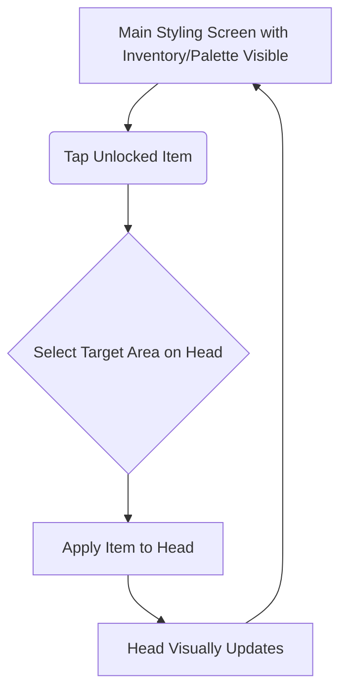

Okay, here is the complete content for the `front-end-spec.md` file:

````markdown
# Mathe-Stylistin UI/UX Specification

## Introduction

[cite_start]This document defines the user experience goals, information architecture, user flows, and visual design specifications for **Mathe-Stylistin**'s user interface[cite: 1369]. [cite_start]It serves as the foundation for visual design and frontend development, ensuring a cohesive and user-centered experience[cite: 1370].

---

## Overall UX Goals & Principles

### Target User Personas

* **Primary: 3rd Grade Math Explorer (Creative Focus)**: Child (8-9 yrs, Bavaria) who dislikes traditional math but enjoys creative/styling activities. [cite_start]Needs engagement, visual rewards, and reduced math anxiety[cite: 1374].
* **(Secondary - Low Priority for MVP):** Parents, Teachers.

### Usability Goals

* **Ease of Learning:** New users should understand the core loop (solve -> unlock -> style) within the first session (e.g., < 5 minutes).
* **Engagement:** The styling aspect should be compelling enough to encourage regular math practice sessions (e.g., 3+ times/week).
* **Error Prevention/Recovery:** Math input should be clear; feedback for wrong answers should be gentle and non-discouraging. Styling actions should be easily undoable if possible.
* [cite_start]**Satisfaction:** Users should feel a sense of accomplishment both from solving math problems and from creating styles[cite: 1375].

### Design Principles

1.  **Playful Encouragement:** The tone, visuals, and feedback should be positive and encouraging, never punitive.
2.  **Clarity & Simplicity:** Interactions and instructions must be immediately understandable for the target age group, minimizing text.
3.  **Rewarding Creativity:** Unlocking and using styling items should feel genuinely rewarding and be the primary motivator.
4.  **Seamless Learning:** Math tasks should feel integrated into the game flow, not like a separate, jarring interruption.
5.  [cite_start]**Safety First:** Design adheres to child safety and privacy principles (especially important given GDPR-K)[cite: 1377].

### Change Log

| Date             | Version | Description                   | Author     |
| :--------------- | :------ | :---------------------------- | :--------- |
| October 25, 2025 | 0.1     | Initial UI/UX Spec draft      | UX Sally   |
| October 25, 2025 | 0.2     | Updated for web platform (breakpoints, units, accessibility) | UX Sally   |

---

## Information Architecture (IA)

### Site Map / Screen Inventory

[cite_start]This diagram shows the main screens/areas of the MVP and how they connect[cite: 1381].

```mermaid
graph TD
    A[Main Styling Screen] --> B{Start Math Task};
    B --> C[Topic Selection Screen];
    C --> D[Math Task Screen/Modal];
    D -- Correct Answer --> E(Show Reward Unlocked);
    E --> A;
    D -- Incorrect Answer --> F(Show Feedback);
    F --> A;
    A --> G[Item Inventory (within Styling Screen)];
````

**Description:**

  * The **Main Styling Screen (A)** is the central hub.
  * From here, the user can initiate a **Math Task (B)**.
  * This first leads to **Topic Selection (C)**.
  * Then, the **Math Task Screen/Modal (D)** is presented.
  * Correct answers trigger a **Reward Notification (E)** and return to Styling.
  * Incorrect answers show **Feedback (F)** and return to Styling.
  * The **Item Inventory (G)** is likely integrated directly into the Main Styling Screen, showing available items.

### Navigation Structure

  * **Primary Navigation:** Will likely be minimal, possibly just access to the math tasks/topics from the main styling screen. No complex menus needed for MVP.
  * **Secondary Navigation:** Not applicable for MVP.
  * **Breadcrumb Strategy:** Not necessary for this simple structure. [cite\_start]Transitions will be direct[cite: 1385].

-----

## User Flows

### Flow 1: Complete a Math Task & Unlock Item

  * [cite\_start]**User Goal:** To solve a math problem correctly and unlock a new styling item[cite: 1388].
  * [cite\_start]**Entry Points:** Tapping a "Start Math Task" button or similar on the Main Styling Screen[cite: 1388].
  * [cite\_start]**Success Criteria:** User correctly solves a math problem, sees a reward notification, and the new item becomes available in their inventory/palette[cite: 1388].

#### Flow Diagram

```mermaid
graph TD
    A[Main Styling Screen] --> B(Tap 'Start Math Task');
    B --> C[Topic Selection Screen];
    C --> D(Select Topic);
    D --> E[Math Task Screen Displays Problem];
    E --> F{Input Answer};
    F -- Submit --> G{Check Answer};
    G -- Correct --> H[Display 'Correct' Feedback];
    H --> I{Unlock Threshold Reached?};
    I -- Yes --> J[Display 'Item Unlocked!' Notification];
    J --> K[Update Inventory/Palette];
    K --> A;
    I -- No --> A;
    G -- Incorrect --> L[Display 'Try Again' Feedback];
    L --> A;
```

#### Edge Cases & Error Handling:

  * User closes app mid-task (progress towards reward might be lost in MVP).
  * Accidental input (needs clear way to submit/confirm answer).
  * [cite\_start]No more items left to unlock in a category (needs clear messaging)[cite: 1389].

#### Notes:

  * This flow covers the core learning and reward loop. Feedback for both correct and incorrect answers is crucial. The reward notification should feel satisfying.

### Flow 2: Apply a Styling Item

  * **User Goal:** To use an unlocked item to customize the character head.
  * **Entry Points:** Being on the Main Styling Screen with unlocked items available.
  * **Success Criteria:** User successfully selects an available item and applies it to the character head, seeing the visual change immediately.

#### Flow Diagram



#### Edge Cases & Error Handling:

  * User tries to apply an item to an incompatible area (provide visual feedback or prevent action).
  * User wants to undo an action (Consider a simple undo button, though maybe post-MVP).
  * Too many items applied (potentially cluttering the view).

#### Notes:

  * This flow focuses on the creative payoff. The interaction needs to be simple and direct (tap item, tap head). Visual feedback is key.

-----

## Wireframes & Mockups

### Design Files

  * **Primary Design Files:** Detailed visual designs and prototypes will ideally be created in a dedicated design tool like Figma, Sketch, or Adobe XD. Once created, the link to the relevant project or frames should be added here. (e.g., `[Link to Figma Project/Frames TBD]`) [cite\_start][cite: 1390].

### Key Screen Layouts

#### Main Styling Screen

  * [cite\_start]**Purpose:** Central hub for viewing the character, accessing styling items, and initiating math tasks[cite: 1393].
  * **Key Elements:**
      * Large central area displaying the character head.
      * Accessible palette/inventory showing available/unlocked colors and accessories (perhaps scrollable at the bottom or side).
      * Clear button/icon to "Start Math Task" or "Practice Math".
      * (Maybe) [cite\_start]A simple indicator of progress towards the next unlock[cite: 1393].
  * **Interaction Notes:** Tap an item in the palette, then tap the appropriate area on the head to apply. [cite\_start]Button press initiates the math flow[cite: 1393].
  * **Design File Reference:** `[Link to Specific Frame TBD]`

#### Topic Selection Screen

  * **Purpose:** Allow the user to choose which math area to practice.
  * **Key Elements:**
      * Clear list or grid of available topics (Addition, Subtraction, Multiplication, Division, Geometry, Sizes).
      * Visually distinct buttons or cards for each topic.
      * Maybe a "Mixed Practice" option.
  * **Interaction Notes:** Tap a topic to start presenting problems from that category.
  * **Design File Reference:** `[Link to Specific Frame TBD]`

#### Math Task Screen/Modal

  * **Purpose:** Present a math problem and capture the user's answer.
  * **Key Elements:**
      * Clearly displayed math problem (question).
      * Input area (e.g., number pad for calculations, multiple-choice options for others).
      * Submit/Confirm button.
      * (Maybe) A simple visual indicator of the selected topic.
  * **Interaction Notes:** User inputs answer and submits. Immediate feedback follows.
  * **Design File Reference:** `[Link to Specific Frame TBD]`

#### Rewards/Unlocks Screen (or Notification)

  * **Purpose:** Inform the user they've unlocked a new item.
  * **Key Elements:**
      * Visually exciting notification (modal overlay or brief animated sequence).
      * Clear image/icon of the unlocked item.
      * Enthusiastic text (e.g., "You unlocked Glitter Pink\!").
      * Button to dismiss and return to styling.
  * **Interaction Notes:** Appears automatically after meeting unlock criteria. User dismisses it.
  * **Design File Reference:** `[Link to Specific Frame TBD]`

-----

## Component Library / Design System

### Design System Approach

  * **Approach:** For the MVP, use Shadcn/ui component library built on Radix UI primitives with Tailwind CSS. [cite\_start]Consistency through Tailwind design tokens and Shadcn component standards[cite: 1397]. [cite\_start]A formal custom design system is post-MVP[cite: 1397].
  * **Customization:** Customize Shadcn components via `components/ui/` folder and Tailwind config.

### Core Components

*(Initial list - Architect/Developer will refine)*

  * **CharacterDisplay:**
      * [cite\_start]**Purpose:** Renders the virtual character head and applied styling items[cite: 1398].
      * **Usage:** Central element on Main Styling Screen.
  * **ItemPalette:**
      * [cite\_start]**Purpose:** Displays available/unlocked styling items[cite: 1398].
      * [cite\_start]**States:** Locked, unlocked, selected[cite: 1398].
      * **Usage:** On Main Styling Screen, allows selection.
  * **MathTaskPresenter:**
      * [cite\_start]**Purpose:** Displays math problem and input controls[cite: 1398].
      * [cite\_start]**Variants:** Different input types[cite: 1398].
      * **Usage:** Within Math Task Screen/Modal.
  * **RewardNotification:**
      * [cite\_start]**Purpose:** Visually informs user of unlocked item[cite: 1398].
      * **Usage:** Appears temporarily after meeting criteria.
  * **TopicSelectorButton:**
      * [cite\_start]**Purpose:** Represents a math topic choice[cite: 1398].
      * **Usage:** On Topic Selection Screen.
  * **Basic Button:**
      * [cite\_start]**Purpose:** Standard action button[cite: 1398].
      * **Usage:** Consistent for main calls to action.

-----

## Branding & Style Guide

### Visual Identity

  * **Brand Guidelines:** No existing guidelines provided. [cite\_start]Establish a simple, consistent style: playful, colorful, encouraging for MVP[cite: 1399]. `[Link to Final Style Guide TBD]`

### Color Palette

*(Proposed - Colors can be refined)*

| Color Type  | Hex Code (Example) | Usage                                       |
| :---------- | :----------------- | :------------------------------------------ |
| Primary     | `#3498DB` (Blue)   | Main actions, highlights                    |
| Secondary   | `#F1C40F` (Yellow)  | Secondary actions, accents, rewards         |
| Accent      | `#E74C3C` (Red/Pink) | Special highlights, notifications         |
| Success     | `#2ECC71` (Green)   | Correct answers, positive feedback        |
| Warning     | `#F39C12` (Orange)  | Mild cautions (if needed)                   |
| Error       | `#E74C3C` (Red)     | Incorrect answers, errors (use gently)    |
| Neutral     | `#ECF0F1`, `#BDC3C7`, `#34495E` | Backgrounds, borders, text                |

### Typography

#### Font Families

  * [cite\_start]**Primary:** Clean, readable sans-serif from system font stack or web fonts (e.g., `Inter`, `Nunito`, `Poppins`)[cite: 1402].
  * [cite\_start]**Secondary:** (Optional) Playful but readable font for headings/rewards (e.g., `Comic Neue`, `Fredoka`)[cite: 1402].
  * [cite\_start]**Monospace:** Standard monospace for code/debugging (e.g., `Fira Code`, `JetBrains Mono`)[cite: 1402].

#### Type Scale

*(Tailwind-style rem values - 1rem = 16px by default)*

| Element | Size     | Weight   | Line Height |
| :------ | :------- | :------- | :---------- |
| H1      | 1.5rem (24px)  | Bold (700)     | 2rem (32px)        |
| H2      | 1.25rem (20px) | Bold (700)     | 1.75rem (28px)     |
| H3      | 1.125rem (18px) | Semibold (600) | 1.5rem (24px)      |
| Body    | 1rem (16px)    | Regular (400)  | 1.5rem (24px)      |
| Small   | 0.875rem (14px) | Regular (400)  | 1.25rem (20px)     |

### Iconography

  * [cite\_start]**Icon Library:** Use clear, simple, child-friendly icons (e.g., Material Symbols subset)[cite: 1405].
  * [cite\_start]**Usage Guidelines:** Use consistently with text labels where needed[cite: 1405].

### Spacing & Layout

  * [cite\_start]**Grid System:** Use Tailwind's 4px-based spacing system[cite: 1406].
  * [cite\_start]**Spacing Scale:** Based on 4px increments (0.25rem, 0.5rem, 0.75rem, 1rem, 1.5rem, 2rem, etc.)[cite: 1406].
  * **Common Values:**
    - `p-1` = 4px padding
    - `p-2` = 8px padding
    - `p-4` = 16px padding
    - `p-6` = 24px padding
    - `gap-4` = 16px gap in flexbox/grid

-----

## Accessibility Requirements

### Compliance Target

  * **Standard:** MVP focuses on fundamental accessibility best practices. [cite\_start]WCAG 2.1 Level AA is a post-MVP goal[cite: 1407].

### Key Requirements

*(MVP Basics)*

  * **Visual:**
      * [cite\_start]**Color Contrast:** Meet WCAG AA minimum ratios (4.5:1 for normal text, 3:1 for large text)[cite: 1408].
      * [cite\_start]**Focus Indicators:** Use clear, visible focus rings (Tailwind's `focus:` variants)[cite: 1408].
      * [cite\_start]**Text Sizing:** Use readable default sizes (minimum 16px for body text)[cite: 1408].
  * **Interaction:**
      * [cite\_start]**Keyboard Navigation:** Full keyboard support - all interactive elements focusable and operable via keyboard[cite: 1408].
      * [cite\_start]**Screen Reader Support:** Use semantic HTML and ARIA labels where needed (Radix UI provides built-in ARIA)[cite: 1408].
      * [cite\_start]**Touch Targets:** Ensure minimum 44x44px touch target size on mobile[cite: 1408].
  * **Content:**
      * [cite\_start]**Alternative Text:** Use `alt` attributes for images, `aria-label` for icon-only buttons[cite: 1409].
      * [cite\_start]**Heading Structure:** Use semantic HTML (`h1`, `h2`, `h3`) in proper hierarchy[cite: 1409].
      * [cite\_start]**Form Labels:** Associate labels with inputs using `htmlFor` attribute or wrapping[cite: 1409].
      * **Language:** Specify `lang="de"` on `<html>` tag for German content.

### Testing Strategy

  * [cite\_start]**MVP:** Basic manual checks (contrast, touch size), keyboard navigation testing, limited testing with screen readers (NVDA/VoiceOver)[cite: 1407].
  * **Tools:** Use browser DevTools accessibility inspector, axe DevTools extension.

-----

## Responsiveness Strategy

### Breakpoints

*(Tailwind CSS default breakpoints)*

| Breakpoint   | Min Width | Target Devices                         |
| :----------- | :-------- | :------------------------------------- |
| Mobile (sm)  | 0px       | Mobile Phones (Portrait)               |
| Tablet (md)  | 768px     | Tablets, Large Phones (Landscape)      |
| Desktop (lg) | 1024px    | Small Desktops, Tablets (Landscape)    |
| Desktop (xl) | 1280px    | Standard Desktops                      |
| Wide (2xl)   | 1536px    | Large Desktops                         |

### Adaptation Patterns

  * **Layout Changes:** Mobile-first approach (320px+). Palette displayed below character on mobile, moves to sidebar on tablet+. [cite\_start]Avoid complex multi-column layouts for MVP[cite: 1412].
  * [cite\_start]**Navigation Changes:** Minimal changes likely needed for MVP[cite: 1412].
  * **Content Priority:** Character and palette remain primary. [cite\_start]Math tasks use larger font sizes on desktop[cite: 1412].
  * **Interaction Changes:** Touch-friendly on mobile/tablet, mouse/keyboard optimized on desktop. [cite\_start]Ensure touch targets remain adequate (min 44x44px)[cite: 1412].

-----

## Animation & Micro-interactions

### Motion Principles

  * [cite\_start]**Purposeful:** Provide feedback, guide attention, smooth transitions[cite: 1413].
  * [cite\_start]**Playful & Quick:** Light, responsive motion[cite: 1413].
  * [cite\_start]**Performance-Conscious:** Must be smooth on target devices[cite: 1413].

### Key Animations (MVP Examples)

  * [cite\_start]**Feedback Animation:** Brief, positive effect for correct answers/unlocks; gentle effect for incorrect[cite: 1413].
  * [cite\_start]**Item Application:** Subtle effect when item is applied[cite: 1413].
  * [cite\_start]**Button Feedback:** Standard touch feedback[cite: 1413].
  * [cite\_start]**Screen Transitions:** Simple slide or fade (if needed)[cite: 1413].

-----

## Performance Considerations

### Performance Goals

  * [cite\_start]**Initial Load:** First Contentful Paint (FCP) < 2 seconds, Time to Interactive (TTI) < 5 seconds[cite: 1415].
  * [cite\_start]**Interaction Response:** Styling, answer submission < 200ms[cite: 1415].
  * [cite\_start]**Animation FPS:** Smooth 60 FPS animations using Framer Motion[cite: 1415].
  * **Bundle Size:** Keep JavaScript bundle < 300KB gzipped for MVP.

### Design Strategies (to support performance)

  * [cite\_start]**Asset Optimization:** Use SVG for icons/graphics, WebP for raster images, lazy load images[cite: 1414].
  * [cite\_start]**Minimize Complexity:** Keep UI structure simple, avoid deep component nesting[cite: 1414].
  * [cite\_start]**Code Splitting:** Vite automatically splits routes, consider dynamic imports for heavy components[cite: 1414].
  * [cite\_start]**Efficient Rendering:** Use `React.memo` for expensive components, optimize re-renders with proper state placement[cite: 1414].
  * **CSS Optimization:** Tailwind purges unused CSS in production builds automatically.

-----

## Next Steps

### Immediate Actions

1.  [cite\_start]**Stakeholder Review:** Share this UI/UX Spec, PRD, and Brief for final review[cite: 1416].
2.  [cite\_start]**Visual Design:** Begin creating detailed mockups/prototypes in a design tool[cite: 1416]. Link file when ready.
3.  [cite\_start]**Curriculum & Asset Finalization:** Continue defining math problems and visual assets[cite: 1416].
4.  [cite\_start]**Handoff to Architect:** Provide this spec, PRD, and brief to the Architect agent[cite: 1416].

### Design Handoff Checklist

  * [cite\_start][x] All user flows documented (MVP core flows defined) [cite: 1417]
  * [cite\_start][x] Component inventory complete (Initial core components identified) [cite: 1417]
  * [cite\_start][x] Accessibility requirements defined (MVP basics outlined) [cite: 1417]
  * [cite\_start][x] Responsive strategy clear (Mobile-first with basic tablet adaptation) [cite: 1417]
  * [cite\_start][x] Brand guidelines incorporated (Initial style guide drafted) [cite: 1417]
  * [cite\_start][x] Performance goals established (MVP goals defined) [cite: 1418]

-----

## Checklist Results

  * [cite\_start]No specific UI/UX checklist was executed against this document at this time[cite: 1419].

<!-- end list -->

```
```