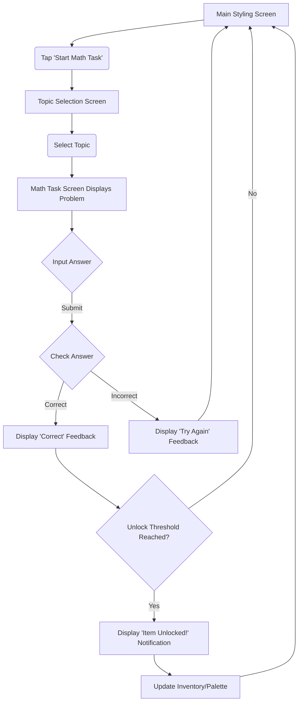
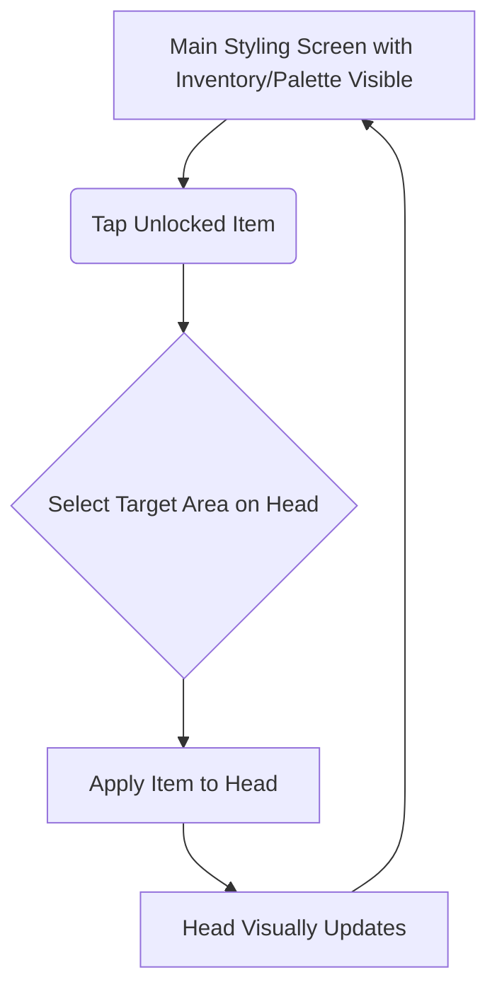

# User Flows

## Flow 1: Complete a Math Task & Unlock Item

  * [cite\_start]**User Goal:** To solve a math problem correctly and unlock a new styling item[cite: 1388].
  * [cite\_start]**Entry Points:** Tapping a "Start Math Task" button or similar on the Main Styling Screen[cite: 1388].
  * [cite\_start]**Success Criteria:** User correctly solves a math problem, sees a reward notification, and the new item becomes available in their inventory/palette[cite: 1388].

### Flow Diagram

### Edge Cases & Error Handling:

  * User closes app mid-task (progress towards reward might be lost in MVP).
  * Accidental input (needs clear way to submit/confirm answer).
  * [cite\_start]No more items left to unlock in a category (needs clear messaging)[cite: 1389].

### Notes:

  * This flow covers the core learning and reward loop. Feedback for both correct and incorrect answers is crucial. The reward notification should feel satisfying.

## Flow 2: Apply a Styling Item

  * **User Goal:** To use an unlocked item to customize the character head.
  * **Entry Points:** Being on the Main Styling Screen with unlocked items available.
  * **Success Criteria:** User successfully selects an available item and applies it to the character head, seeing the visual change immediately.

### Flow Diagram

### Edge Cases & Error Handling:

  * User tries to apply an item to an incompatible area (provide visual feedback or prevent action).
  * User wants to undo an action (Consider a simple undo button, though maybe post-MVP).
  * Too many items applied (potentially cluttering the view).

### Notes:

  * This flow focuses on the creative payoff. The interaction needs to be simple and direct (tap item, tap head). Visual feedback is key.

-----
